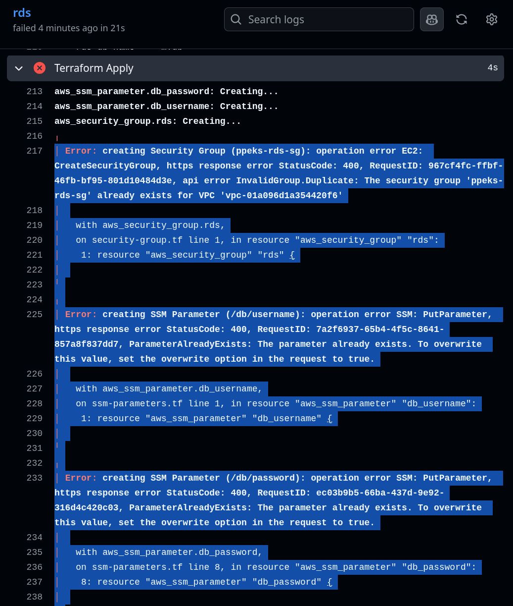

# Esta documentação está em construção, então as informações ainda não estão na ordem correta, nem com as devidas evidências!

---

# Uso recomendado de Inteligência Artificial

A IA não substitui treinamentos e conhecimentos prévios acadêmicos das tecnologias envolvidas neste laboratório, apenas auxilia com dúvidas pontuais, ou sugere melhorias.

Seja na edição de prompts, ou nas respostas da IA, ter este conhecimento prévio, acelera o resultado esperado.

No uso de IA se faz imprescindível um desenho prévio de toda a arquitetura, bem como as etapas, pois a falta deste planejamento, gera prompts desnecessários, com saídas desnecessárias, poluindo todo o histórico de mensagens, resultando em perca de tempo nas buscas pos informações úteis.

Uma documentação bem feita (a exemplo do Projeto_Anterior.md, disponível no diretório raiz deste repositório), também traz insumos para análise de IA, o que foi disruptivo para a evolução do projeto. Por padrão IAs fazem a leitura de Readme, então tenha sempre em mente a importância de boas documentações.

---

# Acesso a AWS

Certifique-se que o usuário que acessa a console (1), seja o mesmo usuário com acesso via awscli (2), e o mesmo usuário ao qual serão concedidas as permissões de visualização (3):


1 - Lembrando que ao logar com o usuário root da conta, o que geralmente é o comum, não será possível visualizar, Pods, Services, etc... (isso pode causar confusão).

2 - Acesso via awscli, será com esse mesmo usuário que executaremos os comandos via Kubectl:
```
[carina@fedora pp_eks]$ aws sts get-caller-identity
{
...
"Arn": "arn:aws:iam::749000351410:user/devops"
}

```

3 - Permissões atribuídas via IAM (código Terraform), ao mesmo usuário:


---

# Laboratório OTEL

Este laboratório evoluiu de acordo com uma experiência anterior, descrita no arquivo Projeto_Anterior.md.

A proposta atual é adaptar para a Cloud AWS o laboratório do treinamento:

https://github.com/lftraining/LFS148-code

Como no print abaixo, os containers (Docker na estrutura do curso), serão orquestrados em um EKS na AWS, sendo a infra construida com o GitHub Actions/Terraform, o deploy das aplicações gerenciados via Helm, sendo o Github a única fonte de verdade para o ArgoCD.


Obs.: Como já temos um front em Python, não utilizaremos o microsserviço Todoui-thymeleaf.

OpentelemetryDemo:

https://opentelemetry.io/ecosystem/demo/

A construção será feita de forma didática e intuitiva, bem detalhada através desta documentação.

# Topologia da AWS

No laboratório anterior, foi sugerido o uso do Traefik, no qual este deploy do Kubernetes faria a gerencia das rotas (conceitos de CKA). Como queremos explorar mais os recursos da AWS (atualmente estudando para AWS Certified Solutions Architect Associate), para este Laboratório vamos utilizar o AWS ALB Ingress Controller, expondo aplicações.

De fato o deploy é feito pelo Helm, que é um gerenciador de pacotes do Kubernetes, mas ele fará a criação e gerencia do ALB, que por sua vez é um recurso da AWS. Aliás, qualquer serviço exposto em um EKS, sem "annotations" específicos, pode criar um ELB (geralmente é criado um "Clássico", com poucos recursos), mas a diferença é que para os próximos deployments, vamos usar os "annotations", para que estes utilizem o ALB previamente criado, e não crie outro ALB.

Também no laboratório anterior, no destroy da infra, a pipeline quebrava por conta que o ALB estava com aplicações criadas no EKS, o que não permitia a destruição do cluster. Então com a instalação/desinstalação do ALB Ingress Controller via pipeline do GitHub Actions, a infra fica totalmente apartada do deploy permitindo flexibilidade.

Também temos granularidade em qualquer alteração da pasta "iac_eks" podendo ser executada através de uma pipeline específica para a infra.

# Cluster EKS

Validação e configurações iniciais:

```
aws eks update-kubeconfig --region us-east-1 --name ppeks-cluster
Updated context arn:aws:eks:us-east-1:749000351410:cluster/ppeks-cluster in /home/carina/.kube/config

kubectl config use-context  arn:aws:eks:us-east-1:749000351410:cluster/ppeks-cluster
Switched to context "arn:aws:eks:us-east-1:749000351410:cluster/ppeks-cluster".
```

# Features

Instalação manual via kubectl, do deploy de métricas, para coleta de informações de CPU e Memória de Nodes e Pods:

```
[carina@fedora pp_eks]$ k apply -f ./features/metrics.yaml
serviceaccount/metrics-server created
clusterrole.rbac.authorization.k8s.io/system:aggregated-metrics-reader created
clusterrole.rbac.authorization.k8s.io/system:metrics-server created
rolebinding.rbac.authorization.k8s.io/metrics-server-auth-reader created
clusterrolebinding.rbac.authorization.k8s.io/metrics-server:system:auth-delegator created
clusterrolebinding.rbac.authorization.k8s.io/system:metrics-server created
service/metrics-server created
deployment.apps/metrics-server created
apiservice.apiregistration.k8s.io/v1beta1.metrics.k8s.io created
``` 

Obs.: Em um primeiro deploy com apenas dois nodes no cluster, não haviam CPU e Memória suficientes para a implementação do recurso (considerando com o deploy do ALB Controller):

```
[carina@fedora pp_eks]$ k -n kube-system get deploy
NAME                           READY   UP-TO-DATE   AVAILABLE   AGE
aws-load-balancer-controller   2/2     2            2           22m
coredns                        2/2     2            2           24m
metrics-server                 0/1     1            0           10m

[carina@fedora pp_eks]$ k -n kube-system describe po metrics-server-df8589546-gr5gp
...
Events:
  Type     Reason            Age    From               Message
  ----     ------            ----   ----               -------
  Warning  FailedScheduling  3m34s  default-scheduler  0/2 nodes are available: 2 Too many pods. no new claims to deallocate, preemption: 0/2 nodes are available: 2 No preemption victims found for incoming pod.
```

Após a adição de mais um node:

```
[carina@fedora pp_eks]$ k get no
NAME                         STATUS   ROLES    AGE   VERSION
ip-10-0-3-155.ec2.internal   Ready    <none>   21m   v1.34.2-eks-ecaa3a6
ip-10-0-4-171.ec2.internal   Ready    <none>   36s   v1.34.2-eks-ecaa3a6
ip-10-0-4-213.ec2.internal   Ready    <none>   21m   v1.34.2-eks-ecaa3a6

[carina@fedora pp_eks]$ k -n kube-system get deploy
NAME                           READY   UP-TO-DATE   AVAILABLE   AGE
aws-load-balancer-controller   2/2     2            2           26m
coredns                        2/2     2            2           28m
metrics-server                 1/1     1            1           14m

[carina@fedora pp_eks]$ k get po -A
NAMESPACE     NAME                                            READY   STATUS    RESTARTS   AGE
kube-system   aws-load-balancer-controller-68bc9587b7-2zbn4   1/1     Running   0          23m
kube-system   aws-load-balancer-controller-68bc9587b7-tsxnd   1/1     Running   0          23m
kube-system   aws-node-2w92l                                  2/2     Running   0          22m
kube-system   aws-node-8dxv2                                  2/2     Running   0          83s
kube-system   aws-node-dlkdq                                  2/2     Running   0          22m
kube-system   coredns-7d58d485c9-29ds5                        1/1     Running   0          25m
kube-system   coredns-7d58d485c9-rqn5l                        1/1     Running   0          25m
kube-system   kube-proxy-7qkdd                                1/1     Running   0          22m
kube-system   kube-proxy-c56sg                                1/1     Running   0          83s
kube-system   kube-proxy-hhhgw                                1/1     Running   0          22m
kube-system   metrics-server-df8589546-gr5gp                  1/1     Running   0          11m
```

Enfim, Métricas de Nodes e Pods:

```
[carina@fedora pp_eks]$ k top no
NAME                         CPU(cores)   CPU(%)   MEMORY(bytes)   MEMORY(%)   
ip-10-0-3-155.ec2.internal   31m          1%       379Mi           73%         
ip-10-0-4-171.ec2.internal   42m          2%       315Mi           61%         
ip-10-0-4-213.ec2.internal   33m          1%       375Mi           73%    

[carina@fedora pp_eks]$ k top po -A
NAMESPACE     NAME                                            CPU(cores)   MEMORY(bytes)   
kube-system   aws-load-balancer-controller-68bc9587b7-2zbn4   1m           20Mi            
kube-system   aws-load-balancer-controller-68bc9587b7-tsxnd   2m           20Mi            
kube-system   aws-node-2w92l                                  2m           43Mi            
kube-system   aws-node-8dxv2                                  3m           42Mi            
kube-system   aws-node-dlkdq                                  3m           43Mi            
kube-system   coredns-7d58d485c9-29ds5                        2m           11Mi            
kube-system   coredns-7d58d485c9-rqn5l                        2m           13Mi            
kube-system   kube-proxy-7qkdd                                1m           18Mi            
kube-system   kube-proxy-c56sg                                1m           18Mi            
kube-system   kube-proxy-hhhgw                                1m           19Mi            
kube-system   metrics-server-df8589546-gr5gp                  3m           18Mi           

```

# Erros mapeados durante a construção do cluster

1 - Erro ao tentar instalar o ALB Controller via Helm, pois a role que o GitHub assumia, ao criar o cluster EKS não tinha permissão de acesso ao cluster.


Solução:

Como o ALB, embora seja uma implementação via Helm, faz a gerência de LBs (infra da AWS) a medida que acontece o "expose" dos deployments, a implementação do Controller que antes era feita via pipe no GitHub Actions, passou a ser feita via modulo no Terraform:

```
[carina@fedora pp_eks]$ tree ./iac_eks/modules/alb-controller/
./iac_eks/modules/alb-controller/
├── data.tf
├── helm_alb.tf
├── iam_policy.json
├── iam.tf
├── locals.tf
├── policy.tf
├── sa.tf
└── variables.tf

1 directory, 8 files
```

2 - IA não revisou "com assertividade" o meu código de criação do RDS, de modo que não tinha TFstate armazenado na AWS, deixando de fazer a gerência de criação/destruição dos recursos, como solicitado:



Solução:

"Feeling" ao perceber erros de recursos que já estavam criados. TFSTATE devidamente configurado:

```
    backend "s3" {
    bucket = "arquivo-de-estado-tf1"
    key    = "rds/terraform.tfstate"
    region = "us-east-1"    
  }
```